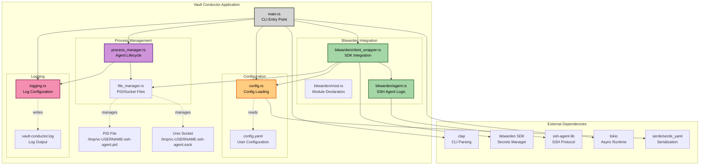
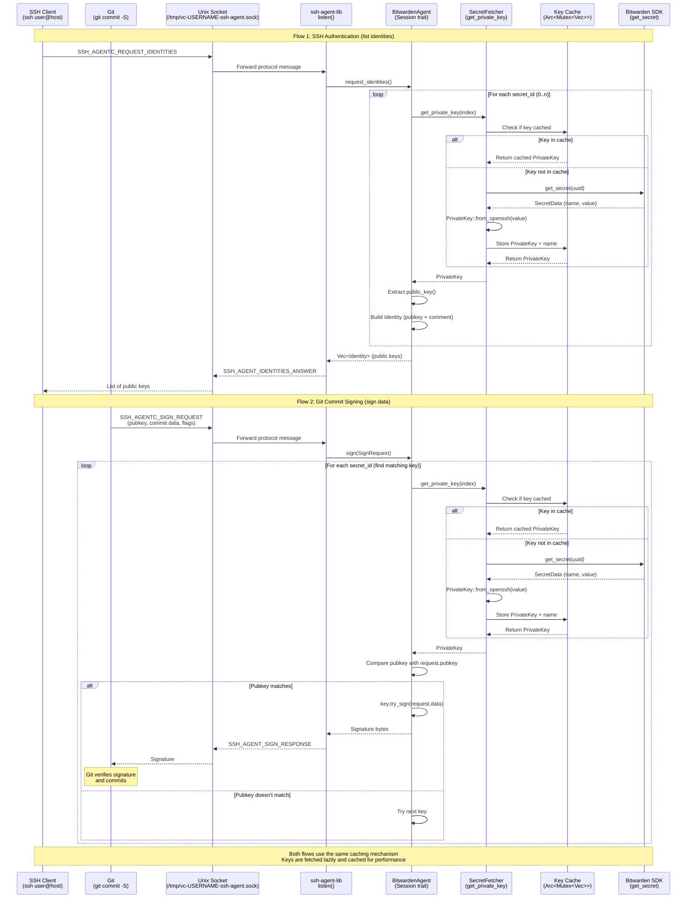
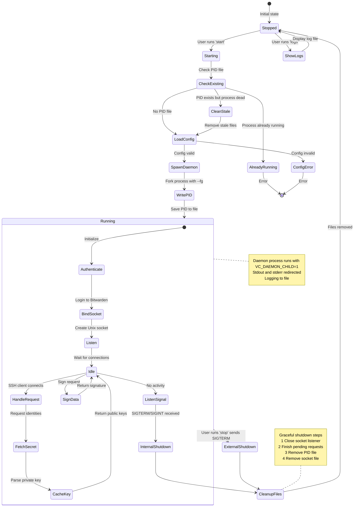
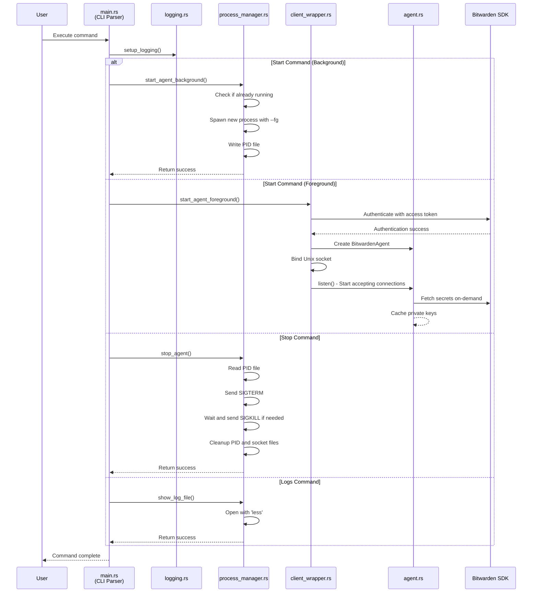
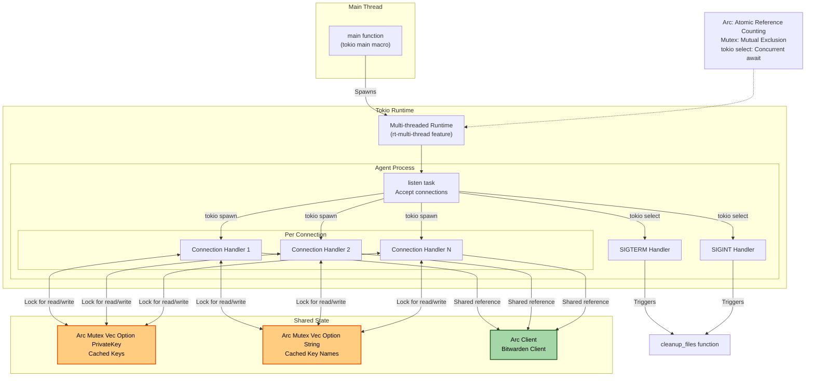

# Architecture Overview

This document provides a visual representation of the vault-conductor codebase and architecture.

The architecture follows these principles:

- **Separation of Concerns**: Each module has a single, well-defined responsibility
- **Trait-based Design**: `SecretFetcher` trait allows for testability and flexibility
- **Error Handling**: Comprehensive error handling with context using `anyhow`
- **Async/Await**: Tokio-based async runtime for efficient I/O
- **Security**: Proper file permissions, signal handling, and graceful shutdown
- **Caching**: Lazy loading and caching of secrets to minimize API calls

## Table of Contents

- [Module Structure](#module-structure)
- [SSH Agent Architecture](#ssh-agent-architecture)
- [Process Lifecycle](#process-lifecycle)
- [Command Flow](#command-flow)
- [Concurrency Model](#concurrency-model)

## Module Structure

The codebase is organized into several key components:

1. **CLI Layer** (`main.rs`): Entry point that parses commands and coordinates between modules
2. **Configuration** (`config.rs`): Handles loading configuration from files or environment variables
3. **Process Management** (`process_manager.rs`, `file_manager.rs`): Manages daemon lifecycle, PID files, and socket files
4. **Bitwarden Integration** (`bitwarden/`): Implements SSH agent protocol backed by Bitwarden Secrets Manager
5. **Logging** (`logging.rs`): Platform-specific logging configuration

## SSH Agent Architecture

This diagram shows how the SSH agent handles authentication requests and signing operations (e.g., git commit signing).

## Process Lifecycle

A complete lifecycle of the agent process is shown below.

## Command Flow

Below, how different CLI commands are processed.

## Concurrency Model

The application's concurrency and synchronization strategy:

