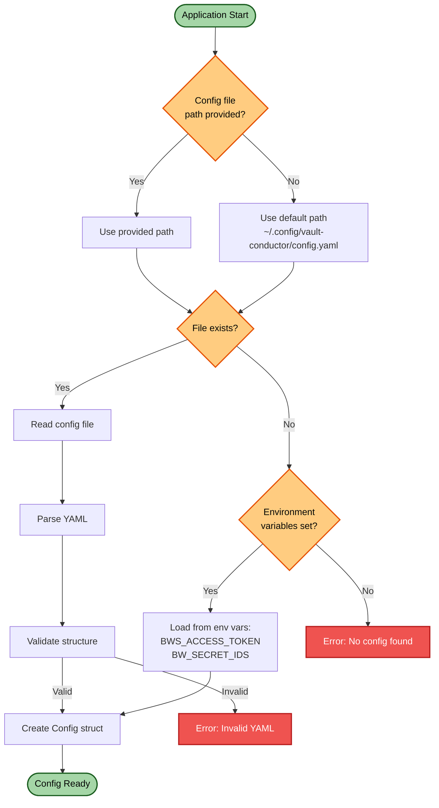

## Configuration Loading

How configuration is loaded and handled by the application.

```mermaid
flowchart TD
    Start([Application Start])

    Start --> CheckConfigPath{Config file<br/>path provided?}

    CheckConfigPath -->|Yes| UseProvided[Use provided path]
    CheckConfigPath -->|No| UseDefault[Use default path<br/>~/.config/vault-conductor/config.yaml]

    UseProvided --> FileExists{File exists?}
    UseDefault --> FileExists

    FileExists -->|Yes| ReadFile[Read config file]
    FileExists -->|No| CheckEnv{Environment<br/>variables set?}

    ReadFile --> ParseYAML[Parse YAML]
    ParseYAML --> Validate[Validate structure]

    CheckEnv -->|Yes| LoadEnv[Load from env vars:<br/>BWS_ACCESS_TOKEN<br/>BW_SECRET_IDS]
    CheckEnv -->|No| Error1[Error: No config found]

    Validate -->|Valid| CreateConfig[Create Config struct]
    Validate -->|Invalid| Error2[Error: Invalid YAML]

    LoadEnv --> CreateConfig

    CreateConfig --> ConfigReady([Config Ready])

    style Start fill:#a5d6a7,stroke:#1b5e20,stroke-width:2px,color:#000
    style ConfigReady fill:#a5d6a7,stroke:#1b5e20,stroke-width:2px,color:#000
    style Error1 fill:#ef5350,stroke:#b71c1c,stroke-width:2px,color:#fff
    style Error2 fill:#ef5350,stroke:#b71c1c,stroke-width:2px,color:#fff
    style CheckConfigPath fill:#ffcc80,stroke:#e65100,stroke-width:2px,color:#000
    style FileExists fill:#ffcc80,stroke:#e65100,stroke-width:2px,color:#000
    style CheckEnv fill:#ffcc80,stroke:#e65100,stroke-width:2px,color:#000
```
