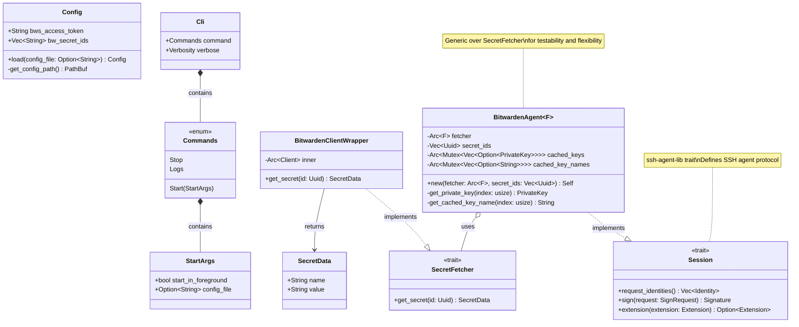

# Data Structures

Key data structures and their relationships below.

```mermaid
classDiagram
    class Config {
        +String bws_access_token
        +Vec~String~ bw_secret_ids
        +load(config_file: Option~String~) Config
        -get_config_path() PathBuf
    }

    class BitwardenAgent~F~ {
        -Arc~F~ fetcher
        -Vec~Uuid~ secret_ids
        -Arc~Mutex~Vec~Option~PrivateKey~~~~ cached_keys
        -Arc~Mutex~Vec~Option~String~~~~ cached_key_names
        +new(fetcher: Arc~F~, secret_ids: Vec~Uuid~) Self
        -get_private_key(index: usize) PrivateKey
        -get_cached_key_name(index: usize) String
    }

    class SecretFetcher {
        <<trait>>
        +get_secret(id: Uuid) SecretData
    }

    class BitwardenClientWrapper {
        -Arc~Client~ inner
        +get_secret(id: Uuid) SecretData
    }

    class SecretData {
        +String name
        +String value
    }

    class Session {
        <<trait>>
        +request_identities() Vec~Identity~
        +sign(request: SignRequest) Signature
        +extension(extension: Extension) Option~Extension~
    }

    class StartArgs {
        +bool start_in_foreground
        +Option~String~ config_file
    }

    class Commands {
        <<enum>>
        Start(StartArgs)
        Stop
        Logs
    }

    class Cli {
        +Commands command
        +Verbosity verbose
    }

    BitwardenAgent ..|> Session: implements
    BitwardenClientWrapper ..|> SecretFetcher: implements
    BitwardenAgent o-- SecretFetcher: uses
    BitwardenClientWrapper --> SecretData: returns
    Cli *-- Commands: contains
    Commands *-- StartArgs: contains

    note for BitwardenAgent "Generic over SecretFetcher\nfor testability and flexibility"

    note for Session "ssh-agent-lib trait\nDefines SSH agent protocol"
```
