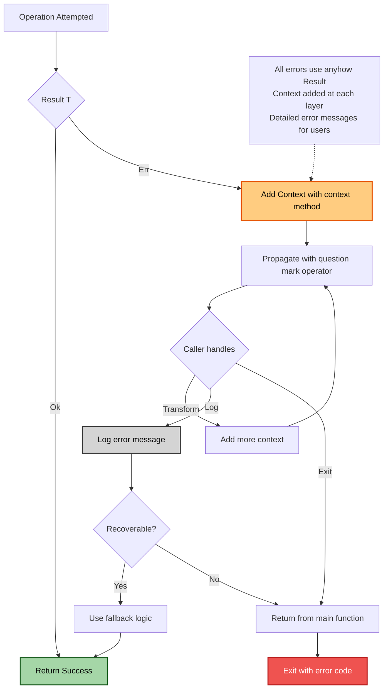

# Error Handling

The diagram shows how errors are handled throughout the application.

```mermaid
flowchart TD
    Operation[Operation Attempted]

    Operation --> Result{Result T}

    Result -->|Ok| Success[Return Success]
    Result -->|Err| AddContext[Add Context with context method]

    AddContext --> Propagate[Propagate with question mark operator]

    Propagate --> Caller{Caller handles}

    Caller -->|Transform| AddMoreContext[Add more context]
    Caller -->|Log| LogError[Log error message]
    Caller -->|Exit| MainError[Return from main function]

    AddMoreContext --> Propagate

    LogError --> Recover{Recoverable?}

    Recover -->|Yes| Fallback[Use fallback logic]
    Recover -->|No| MainError

    Fallback --> Success

    MainError --> ExitCode[Exit with error code]

    style Success fill:#a5d6a7,stroke:#1b5e20,stroke-width:2px,color:#000
    style ExitCode fill:#ef5350,stroke:#b71c1c,stroke-width:2px,color:#fff
    style AddContext fill:#ffcc80,stroke:#e65100,stroke-width:2px,color:#000
    style LogError fill:#D4D4D4,stroke:#333333,stroke-width:2px,color:#000

    Note1[All errors use anyhow Result<br/>Context added at each layer<br/>Detailed error messages for users]

    Note1 -.-> AddContext
```
